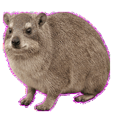
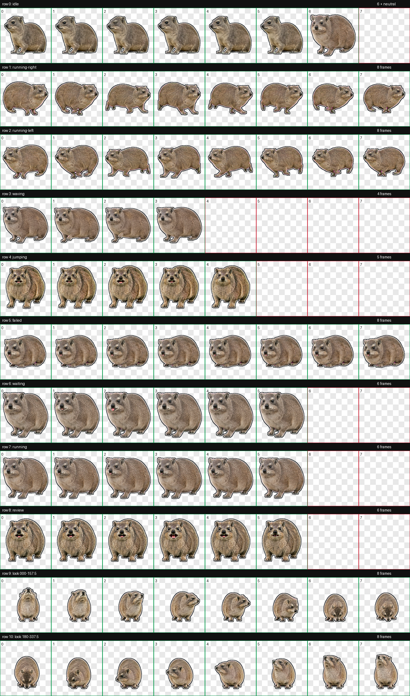
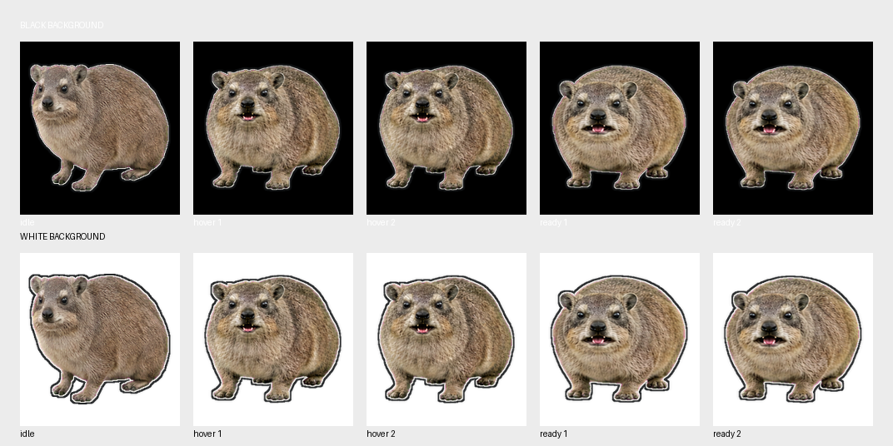
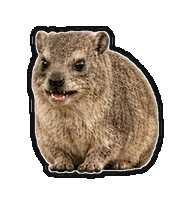
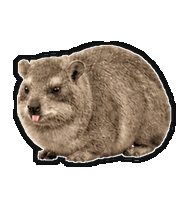
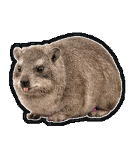
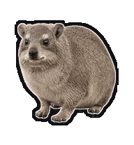
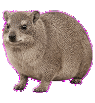
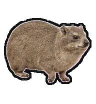
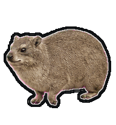

# durax

`dudu`의 `hyrax`, `durax`입니다. 평범하고 실제 동물처럼 생긴 바위너구리 Codex pet입니다.

귀여운 캐릭터나 일러스트가 아니라 짧고 둥근 실제 바위너구리의 생김새를 유지했습니다. 입을 벌리는 동작에서는 작은 앞니가 보이고, 납작하게 앉은 동작에서는 몸을 고정한 채 아주 짧은 혀 끝만 내밀고 있습니다.

마우스를 올리면 뛰지 않고 정면으로 눈을 맞춘 채 `아와와` 소리치는 동작을 합니다. 입을 양옆으로 벌린 첫 발화 뒤, 입을 닫지 않은 채 들숨을 거쳐 두 번째 `와와`를 길게 발화하고 마지막에만 입을 닫습니다.



## 특징

- Codex pet sprite version 2
- 8열 11행, 1536 x 2288 WebP spritesheet
- idle 동작 뒤에 같은 기본 자세로 복귀
- idle 안에서 몸과 발을 고정한 채 화면 왼쪽을 바라보는 동작
- 마우스 hover 시 정면을 보며 `아와와` 하는 동작
- 입을 연 채 첫 발화, 들숨, 두 번째 긴 발화로 이어지는 동작
- 작은 앞니와 짧게 내민 혀 동작
- 한 번 납작하게 앉은 뒤 높이 변화 없이 짧은 혀 끝을 고정하는 동작
- 오른쪽과 왼쪽 달리기의 크기와 발 기준선 일치
- 검정색과 흰색 배경에서 모두 보이는 이중 외곽선
- 모든 프레임에 최소 8px 투명 여백

## 설치

macOS 또는 Linux 터미널에서 다음 명령을 실행합니다.

```sh
git clone https://github.com/dudu-works/durax.git
mkdir -p ~/.codex/pets/durax
cp durax/pet.json ~/.codex/pets/durax/pet.json
cp durax/spritesheet.webp ~/.codex/pets/durax/spritesheet.webp
```

그다음 Codex에서 pet을 `durax`로 선택합니다. 이미 Codex가 실행 중이라면 앱을 다시 시작합니다.

## 미리보기

### 전체 동작 프레임



### 검정색과 흰색 배경 대비



### 입과 혀 동작

마우스 hover:



새 응답 도착:



납작하게 앉아 짧은 혀 끝 내밀기:







좌우 달리기 크기 비교:





## 파일

- `pet.json` - Codex pet 메타데이터
- `spritesheet.webp` - 설치용 최종 spritesheet
- `preview/` - 동작과 외곽선 미리보기
- `qa/validation.json` - spritesheet 형식 검증 결과
- `qa/outline-report.json` - 셀 안전 여백 검증 결과

## 검증 상태

- atlas 오류 0건
- atlas 경고 0건
- 투명 픽셀 RGB 잔여 0개
- 사용된 74개 셀의 최소 여백 8px
